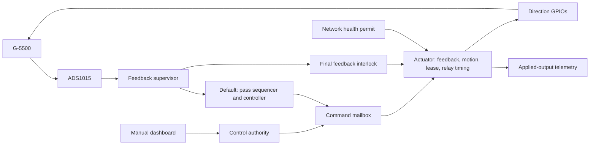

# Architecture

ezal separates deterministic motion policy from the RP2350 peripherals that
feed and apply it. The default build is a hardware-driving walking skeleton:
the METOP-C target source is synthetic; the ADS1015, calibration, controller,
direction GPIOs, and installed rotator are real.

## Runtime data flow

Both modes claim idle direction pins and POST the ADS1015 before WiFi
association or DHCP. Both modes inhibit movement until the station link and a
usable DHCP address are available. Default mode then begins autonomous
acquisition; manual mode waits for a fresh dashboard command and valid feedback.
Network loss clears active and pending motion. Recovery starts acquisition
again without clearing latched acquisition, ADC, or motion faults.

Before each synthetic pass, the sequencer supplies its first horizon target.
The dish must remain within 4° on each axis for one second before the
180-second pass clock begins. Failure to acquire within 120 seconds latches
an `acquire-timeout` fault until reset. The installed profile peaks at 82°
elevation, returns to the horizon, and supplies no target during a 30-second
pause. Successive passes reverse azimuth direction. Phase changes are applied
on a supervision tick, and the actual motor stop also depends on output timing
and mechanical coast. The profile is representative and uses no TLE propagation.

## Workspace boundary

`crates/ezal-core` is `no_std`, deterministic, and hardware-independent:

| Module | Responsibility |
|---|---|
| `position` | Installed calibration, angle/millivolt conversion, ADC rail and range checks |
| `simulation` | Pass schedule and acquire → track → pause sequencing |
| `control` | Target/feedback validation and hysteretic direction decisions |
| `supervisor` | Shared feedback validation, read-timeout latch, autonomous fault precedence, sequencing, coherent telemetry, and the interlock built from its own calibration |
| `authority` | Manual connection ownership, takeover, disconnect, and autonomous exclusivity |
| `mailbox` | Pending-command replacement with unconsumed safety inhibition taking precedence |
| `interlock` | Fresh-feedback and travel-aware endpoint checks on incoming, active, and pending movement |
| `actuator` | Feedback and motion supervision before relay timing, with absolute source expiry preserved for every command |
| `motion` | Applied-output progress budgets, startup settling, direction/speed plausibility, and latched faults |
| `network` | Expiring link/address permission and recovery generations |
| `drive` | Command vocabulary, movement lease, ordinary relay timing, operator release, and immediate inhibition |
| `protocol`, `dashboard` | Wire messages and the served HTML/CSS/JavaScript page |
| `ads1015`, `wifi` | Pure ADC register/decoding and credential logic |

`crates/ezal-firmware` supplies the Embassy/HAL shell:

- `main` selects the mode, runs boot checks, reads paired feedback under a
  deadline, and publishes supervisor results; one loop serves both modes, so
  their deadlines and publication path cannot drift apart;
- `drive` owns the four direction GPIOs and applies whatever the shared
  `actuator` permits, on a fixed 100 ms service schedule, feeding the watchdog
  after each pass;
- `watchdog` configures the independent hardware reset fallback and tells a
  firmware-armed timeout apart from a flashing tool's reboot;
- `ads1015` performs hardware transactions and its power-on test; `wifi`
  initializes the radio and supervises association, DHCP, and recovery;
- `state` stores typed snapshots behind a short critical section, holds the
  published interlock, and wakes the actuator after a command or — while an
  output is energised — a feedback change;
- `web` serves the dashboard and telemetry; `ws_receive` bounds complete
  WebSocket message reception.

A future production target transport can supply timestamped `TimedPointing`
values to the controller. The current firmware has no production serial
target input or TLE propagator.

## Feedback and control tick

Both modes perform a paired ADC read, then wait 100 ms before the next read.
This is a 100 ms delay after work, not an exact fixed-frequency schedule.
Manual mode samples just as fast as autonomous tracking, because the actuator
admits a browser jog only against feedback newer than its validity window.
Dashboard telemetry has a separate 500 ms cadence.

1. Timestamp before starting the oldest channel, then read A0 elevation and
   A1 azimuth under one 500 ms deadline.
2. Reject ADC and supply rail values and voltages beyond calibration's 25 mV
   endpoint margin before trusting the calibrated position. Check sample age
   using the clock after both reads complete, and reject a sample that took
   more than 150 ms: the interlock would expire it before its replacement
   could be read and published.
3. In autonomous mode, advance acquisition/pass sequencing and evaluate the
   timestamped target and feedback. In manual mode, publish feedback health
   while the current browser controller supplies movement.
4. Publish raw readings, tracking telemetry, and the feedback interlock in one
   shared-state transaction. Autonomous mode also submits its control decision;
   movement refreshes are always submitted, an unchanged release once.

The interlock is built by the supervisor from the same calibration it
validates, so the endpoints the controller clamps to and the endpoints the
final gate enforces cannot diverge.

The ADC uses a shared **±4.096 V** range with **2 mV per code**. Calibration
validation requires its complete accepted voltage band to fit strictly above
ground and below the lower of the positive saturation code and the 3.3 V
supply-rail ceiling — the ADS1015 cannot report a reading above its own
supply, so a band reaching that far would make a stuck input look like a valid
endpoint. Changing the PGA range does not change the ADC pin's electrical
input limits.

A cancelled read reports `feedback-stale`, clears feedback readiness, and
latches a bus-reuse prohibition until reset. A late but completed read reports
`feedback-stale` without latching. An uncancelled I²C error reports
`no-feedback` and may recover on a later successful sample. Invalid and stale
feedback cannot advance acquisition settling or replace the last calibrated
position shown in telemetry. Successfully read raw pairs remain available for
diagnostics even when calibration rejects them.

The boot-time ADC POST also has a 500 ms deadline. If it expires, startup
leaves outputs inhibited and never reuses the cancelled bus until reset.
POST tests only writable threshold bits: ADS1015 threshold bits 3:0 are
reserved, so comparing those bits as scratch storage would reject a healthy ADC.

A calibration the ADC cannot supervise reports `calibration-invalid` and
inhibits motion, but sampling continues so the dashboard's raw millivolts stay
live — those readings are how an operator measures the endpoints again.

## Safety layers and their limits

| Layer | Implemented behavior |
|---|---|
| Acquisition | A one-second settle starts the pass; a 120-second acquisition timeout inhibits motion and latches the sequence in fault |
| Feedback validation | ADC and supply rails, calibration faults, future timestamps, reads slower than 150 ms, and samples older than 500 ms inhibit motion in both modes |
| Final feedback gate | Active and pending outputs are rechecked when feedback changes, commands arrive, and feedback expires; a held browser command cannot extend sample validity |
| Mechanical endpoints | Outward motion stops one ADC code before either calibrated endpoint, widened by the fastest travel possible since the sample began; an energised axis is cut at that instant without waiting for another sample. Inward motion and an unaffected axis remain available |
| Controller hysteresis | An idle axis engages at 4° error; a moving axis releases at 1.5° |
| Movement lease | An unrefreshed active command expires after at most 750 ms, further bounded by its source expiry; a late refresh cannot erase an already-expired lease; activation requires enough remaining lease for the 500 ms minimum on-time |
| Motion plausibility | Each axis must show resolvable displacement within 5 s of accumulated energized time; wrong-direction or excessive-speed feedback after startup settling also latches both outputs off until reset |
| Command freshness | Manual movement must reference a server token younger than 1 s and an increasing sequence number; queueing consumes the original deadline, and rejection requires a new telemetry token and operator press |
| Network permission | Link/address loss inhibits outputs; positive observations expire after 300 ms independently of the network task, and recovery cannot replay an old pending request |
| Ordinary relay timing | Controller `Stop` and normal direction changes respect a 500 ms minimum active period and 2 s minimum inactive period |
| Safety inhibition | Faults, feedback/end checks, lease expiry, ownership changes, malformed controller input, and a released or reversed dashboard control clear affected active and pending outputs without waiting for the minimum active period; the 2 s inactive hold remains |
| Hardware watchdog | The output task feeds a 500 ms watchdog after servicing outputs; executor stalls, blocked interrupts, and panic halts stop feeding it |
| Pin ownership | One task owns all direction pins and applies the resulting state before reporting it |

The endpoint band has two parts. One ADC code accommodates quantization without
changing displayed angles — approximately 0.38° azimuth and 0.15° elevation for
the current calibration. The second part is travel: a sample describes where the
dish was when its read began, and an energised axis keeps moving, so the band
grows with the sample's age at the rotator's fastest rate (7°/s azimuth, 3°/s
elevation, the G-5500's 60 Hz rates plus margin). With fresh samples that adds
roughly 0.7° azimuth. Close to an endpoint an outward jog is therefore refused,
or cut early, rather than overshooting. The band does not model motor coasting,
relay release time, analog noise, or every possible sensor failure.

Motion supervision runs in the actuator, which knows the applied directions.
It counts energized time, excluding relay off-holds; repeated short jogs or
reversals do not reset the no-progress budget. Progress requires three
calibrated ADC codes of displacement, with two codes of noise allowance.
Direction/speed checks allow one second for startup and reversal settling;
speed checks also use a longer observation window so each new sample cannot
spend the same noise allowance repeatedly. These defaults in `MotionConfig`
are commissioning starting points, not measured installation characteristics.
The first fault is reported in control telemetry and inhibits both axes until
firmware reset, even after feedback or networking recovers.

The output task services the boundary on a fixed 100 ms schedule and also wakes
for the earliest feedback, motion, network, lease, or relay deadline, and for each command.
Software deadlines depend on the executor making progress. The hardware watchdog
continues while the CPU is halted and resets the selected RP2350 domains
including SIO, which takes the pins out of the stalled executor's control. The
board's transistor-base pull-downs then hold the switches off — but RP2350 pads
have isolation latches that can hold a pin's last output state through a reset
until boot reinitialises the pad, so that hand-off is not instantaneous and is
listed as a bench measurement in [DEVELOPMENT.md](DEVELOPMENT.md). Boot detects a
watchdog timeout that this firmware armed and holds the outputs low; it does not
automatically restart tracking, and it does not confuse a UF2 or `picotool`
reboot — which also restarts the chip through the watchdog — with a fault. An
explicit board/debug reset or power cycle is required after investigation.

These are implemented safeguards, not a measured physical stop-time guarantee.
Correct end stops, wiring, an accessible motor-power disconnect, and hardware
fault-injection tests remain necessary. See [CALIBRATION.md](CALIBRATION.md)
and [HARDWARE.md](HARDWARE.md).

## Shared state and command ownership

`SharedState` holds a typed snapshot inside a blocking critical-section mutex.
The critical sections copy or update small values; none crosses an await or
performs I/O. Raw feedback pairs and tracking snapshots are coherent, and the
GPIO task records its applied logical drive separately. The position, tracking,
and control WebSocket messages are separate transmissions and may reflect
different publication ticks.

The snapshot also contains the pure control authority, feedback interlock, and
command mailbox. A separate wake signal lets a feedback update wake the output
task without replacing a pending command. An unconsumed `Inhibit` cannot be
overwritten by a browser refresh or later ordinary command. After the actuator
consumes it, a new valid command may resume movement subject to the inactive
hold; feedback recovery alone does not replay an old movement request.

Autonomous mode excludes all browser takeovers and drive commands. In the
manual build, the first connection receives unclaimed control. Another viewer
may explicitly take over, immediately revoking the previous movement request.
An old owner's later commands or disconnect cannot affect the new owner.
Disconnecting the current owner inhibits movement without silently promoting
another viewer. Operator `stop`, malformed text, and binary input from the
current controller also inhibit movement. Dashboard drive indicators use the
GPIO task's reported applied output and show `unknown` after disconnection or
loss of fresh application telemetry. A motion fault is displayed separately
from the tracking supervisor's health so a healthy ADC cannot hide a latched
actuator failure.

Each periodic telemetry batch ends with a server-generated token. Its one-second
expiry is recorded before the batch is written, so slow writes consume its
lifetime. Movement uses `press:<token>:<sequence>:drive:cw` for new input and
`hold:<token>:<sequence>:drive:cw` for refreshes; combined axes use `cw+up` etc.
Bare `drive:` messages are rejected. Tokens are decimal strings because browser
numbers cannot represent every `u64` exactly. The actuator receives the earlier
of token expiry and receipt plus 750 ms; the mailbox does not renew it.

Tokens are bound to the connection and network recovery generation. Invalid,
expired, or replayed movement clears the held intent and invalidates the old
tokens. Control takeover likewise requires a new telemetry batch before another
press. The browser clears its hold after one second without a completing
telemetry token and on page suspension. Recovery always requires new operator
input. These checks establish bounded command age, not authentication.

The dashboard has eight concurrent acceptors. Each WebSocket receive operation
has a 2 s outer deadline covering an incomplete header, payload, or fragmented
message. An idle receive can still return its telemetry tick. On a message
timeout, the callback releases ownership and ends the connection; it never
reuses a partially consumed parser or waits for a WebSocket close handshake.
The adapter uses picoserve's frame decoder and bounded assembly storage because
picoserve 0.20.1 still rejects control frames between message fragments.
Interleaved Ping/Pong preserves the partial message; Close ends the connection.
Ping replies consume the same whole-message deadline. The TCP shutdown and
write paths have their own picoserve timeouts.

The prototype dashboard assumes a trusted local network. Ownership prevents
conflicting clients; it is not authentication or access control. Authentication
and a production command transport are deferred work.

Arming and stop authority remain a separate product decision: autonomous mode
starts automatically once feedback and networking permit it and does not accept
browser stops. The eight HTTP acceptors also serve persistent WebSockets, so
eight connected viewers consume all connection capacity.

HTTP acceptors run independently of association/DHCP success. Network supervision
retains the radio control handle, retries failed association or DHCP after
1, 2, 4, ... up to 30 seconds, and clears the previous DHCP configuration before
each attempt. Association and disassociation are bounded; DHCP gets 30 seconds.
Readiness means a station link and a usable local IPv4 address, not internet
reachability. Loss events revoke permission immediately when observed; a 100 ms
poll also detects address changes and renews a 300 ms permit that the output
task checks independently. Losing permission revokes manual ownership and all
queued movement. A new generation on recovery forces pending relay transitions
to be cleared and autonomous acquisition to restart.
Radio firmware upload and low-level device initialization precede that
supervisor. A hardware fault there keeps the initial network permit offline;
recovering the consumed peripheral/driver resources requires a board reset.

## Verification

Host Rust tests cover calibration, ADC and supply rails, supervisor fault
precedence, acquisition and pass transitions, ownership transfer, command
inhibition priority, feedback expiry during held commands, pending-output
cancellation, quantized and travel-aware endpoint limits, controller
hysteresis, lease expiry and lease-covered activation, relay timing, operator
release, stuck/incorrect/implausible feedback, network expiry/recovery, command
age/replay, protocol JSON, and bounded fragmented reception through the pinned
picoserve frame decoder. They exercise the actuator sequence the firmware runs, rather than
re-stating its order. Apart from one installation sanity test, they use their
own calibration fixture, so replacing the installed endpoints cannot break
them. Node tests execute the dashboard's served JavaScript with fake browser
events to exercise command refresh, ownership loss, disconnect/reconnect, and
input release behavior.

CI runs formatting, host tests, Clippy, and the dashboard tests in their own
Node-only shell. One firmware job builds, lints, and packages both the default
walking skeleton and the manual feature set for `thumbv8m.main-none-eabihf`,
keeping their images in per-mode artifact directories. See
[DEVELOPMENT.md](DEVELOPMENT.md) for the corresponding commands.

Host checks and cross-compilation do not validate physical behavior. Before
enabling a connected rotator, measure the installed endpoints, confirm polarity,
inject feedback/link faults, and verify watchdog reset, output release, and
coast/brake behavior on the board.
